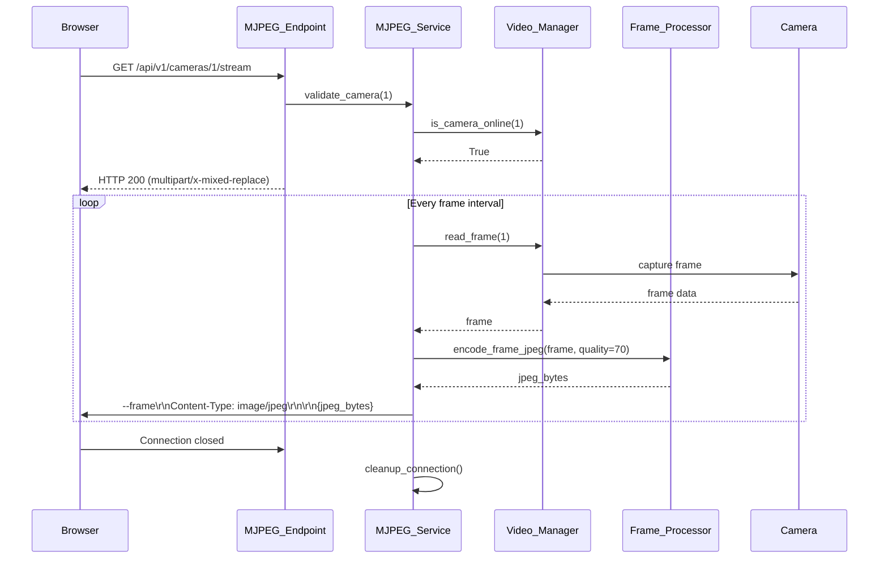
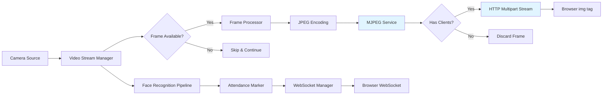

# Design Document: MJPEG Video Streaming

## Overview

This design document specifies the implementation of MJPEG (Motion JPEG) video streaming to replace the current WebSocket-based video streaming in the face recognition attendance system. The current implementation suffers from browser freezing, constant disconnections, and blinking online/offline status due to large base64-encoded JPEG frames overwhelming the WebSocket connection.

The MJPEG solution uses HTTP multipart responses (`multipart/x-mixed-replace`) for efficient video streaming, which is natively supported by browsers. This approach separates concerns: HTTP handles video streaming while WebSocket handles only real-time events (attendance notifications and camera status updates).

### Key Benefits

- Native browser support for MJPEG streams via `` tags
- Eliminates WebSocket bandwidth congestion
- Reduces browser memory usage and prevents freezing
- Maintains stable WebSocket connections for events
- Simpler client-side implementation
- Better scalability for multiple concurrent camera streams

### Design Goals

1. Implement MJPEG streaming using HTTP multipart responses
2. Provide individual stream endpoints per camera
3. Integrate with existing Video_Stream_Manager and Frame_Processor
4. Remove frame data from WebSocket messages
5. Maintain backward compatibility with camera management APIs
6. Support concurrent connections from multiple clients
7. Handle errors gracefully without affecting other streams

## Architecture

### High-Level Architecture

```mermaid
graph TB
    subgraph "Frontend (Next.js)"
        A[Camera Page Component]
        B[Stream Display Component]
        C[WebSocket Hook]
    end
    
    subgraph "Backend (FastAPI)"
        D[MJPEG Stream Endpoint]
        E[MJPEG Stream Service]
        F[Video Stream Manager]
        G[Frame Processor]
        H[WebSocket Manager]
        I[Camera Routes]
    end
    
    subgraph "Data Layer"
        J[(PostgreSQL)]
        K[(Redis)]
    end
    
    subgraph "External Services"
        L[Camera Sources]
        M[CompreFace]
    end
    
    B -->|HTTP GET /api/v1/cameras/{id}/stream| D
    A -->|WebSocket /ws/attendance| H
    D --> E
    E --> F
    E --> G
    F --> L
    H --> C
    I --> J
    E --> J
    
    style E fill:#e1f5ff
    style D fill:#e1f5ff
    style B fill:#fff4e1
```

### Component Interaction Flow



### Data Flow Diagram



## Components and Interfaces

### 1. MJPEG Stream Service

**Purpose**: Core service that generates MJPEG streams from camera sources and manages client connections.

**Location**: `attendance-system/app/services/mjpeg_streaming.py`

**Class**: `MJPEGStreamService`

#### Attributes

```python
class MJPEGStreamService:
    video_stream_manager: VideoStreamManager  # Existing service for camera management
    frame_processor: FrameProcessor           # Existing service for frame encoding
    db: Session                               # Database session
    active_streams: Dict[str, Set[str]]       # camera_id -> set of client_ids
    stream_locks: Dict[str, asyncio.Lock]     # Per-camera locks
    jpeg_quality: int = 70                    # JPEG quality for MJPEG streams
```

#### Methods

```python
async def generate_mjpeg_stream(
    self,
    camera_id: str,
    client_id: str
) -> AsyncGenerator[bytes, None]:
    """
    Generate MJPEG stream for a specific camera.
    
    Yields multipart HTTP response chunks with JPEG frames.
    Handles client disconnection and cleanup.
    
    Args:
        camera_id: Camera identifier
        client_id: Unique client connection identifier
        
    Yields:
        bytes: Multipart HTTP chunks with JPEG frames
        
    Raises:
        CameraNotFoundError: If camera doesn't exist
        CameraOfflineError: If camera is not online
    """

async def validate_camera(self, camera_id: str) -> Camera:
    """
    Validate that camera exists and is active.
    
    Args:
        camera_id: Camera identifier
        
    Returns:
        Camera: Camera database model
        
    Raises:
        CameraNotFoundError: If camera doesn't exist
        CameraInactiveError: If camera is not active
    """

def register_client(self, camera_id: str, client_id: str) -> None:
    """
    Register a client connection for a camera stream.
    
    Args:
        camera_id: Camera identifier
        client_id: Unique client connection identifier
    """

def unregister_client(self, camera_id: str, client_id: str) -> None:
    """
    Unregister a client connection and cleanup resources.
    
    Args:
        camera_id: Camera identifier
        client_id: Unique client connection identifier
    """

def get_client_count(self, camera_id: str) -> int:
    """
    Get number of active clients for a camera.
    
    Args:
        camera_id: Camera identifier
        
    Returns:
        int: Number of connected clients
    """

async def get_frame_interval(self, camera_id: str) -> float:
    """
    Get frame interval for a camera based on configured frame rate.
    
    Args:
        camera_id: Camera identifier
        
    Returns:
        float: Seconds between frames (1.0 / frame_rate)
    """
```

### 2. MJPEG Stream Endpoint

**Purpose**: FastAPI endpoint that serves MJPEG streams via HTTP.

**Location**: `attendance-system/app/routes/mjpeg_stream.py`

**Router**: `router = APIRouter()`

#### Endpoints

```python
@router.get("/cameras/{camera_id}/stream")
async def stream_camera(
    camera_id: int,
    request: Request,
    db: Session = Depends(get_db),
    mjpeg_service: MJPEGStreamService = Depends(get_mjpeg_service)
) -> StreamingResponse:
    """
    Stream MJPEG video from a camera.
    
    Args:
        camera_id: Camera identifier
        request: FastAPI request object (for disconnect detection)
        db: Database session
        mjpeg_service: MJPEG streaming service
        
    Returns:
        StreamingResponse: HTTP response with multipart/x-mixed-replace content
        
    Raises:
        HTTPException 404: Camera not found
        HTTPException 400: Camera not active
        HTTPException 503: Camera offline
    """
```

### 3. Frontend Stream Display Component

**Purpose**: React component that displays MJPEG streams using HTML img tags.

**Location**: `attendance-dashboard/app/components/MJPEGCameraFeed.tsx`

**Component**: `MJPEGCameraFeed`

#### Props Interface

```typescript
interface MJPEGCameraFeedProps {
  cameraId: string;
  locationName: string;
  status: 'online' | 'offline' | 'error';
  apiBaseUrl?: string;
}
```

#### Component Structure

```typescript
export default function MJPEGCameraFeed({
  cameraId,
  locationName,
  status,
  apiBaseUrl = 'http://192.168.0.111:8001'
}: MJPEGCameraFeedProps) {
  const [isLoading, setIsLoading] = useState(true);
  const [hasError, setHasError] = useState(false);
  const streamUrl = `${apiBaseUrl}/api/v1/cameras/${cameraId}/stream`;
  
  // Handle image load events
  // Render img tag with streamUrl
  // Display status indicators
  // Handle errors
}
```

### 4. Modified WebSocket Manager

**Purpose**: Updated WebSocket manager that no longer sends frame data.

**Location**: `attendance-system/app/services/websocket.py` (existing, to be modified)

**Changes**:
- Remove `broadcast_frame()` method calls
- Keep `broadcast_attendance_event()` method
- Keep `broadcast_camera_status()` method
- Update message types to exclude `frame_update`

#### Message Types (After Modification)

```python
# Attendance Event Message
{
    "type": "attendance_event",
    "student_id": str,
    "student_name": str,
    "camera_location": str,
    "timestamp": str,  # ISO format
    "confidence_score": float
}

# Camera Status Message
{
    "type": "camera_status",
    "camera_id": str,
    "status": str,  # "online", "offline", "error"
    "error_message": str | None,
    "timestamp": str  # ISO format
}
```

### 5. Modified Video Streaming Service

**Purpose**: Updated orchestrator that no longer broadcasts frames via WebSocket.

**Location**: `attendance-system/app/services/video_streaming.py` (existing, to be modified)

**Changes**:
- Remove `StreamBroadcaster.broadcast_frame()` calls from `_process_camera_pipeline()`
- Keep face recognition pipeline intact
- Keep attendance marking logic intact
- Keep camera status broadcasting intact

## Data Models

### Camera Model (Existing)

```python
class Camera(Base):
    __tablename__ = "cameras"
    
    id = Column(Integer, primary_key=True, autoincrement=True)
    name = Column(String(100), nullable=False)
    location = Column(String(100), nullable=False)
    stream_url = Column(String(500), nullable=False)
    protocol = Column(String(20), nullable=False)  # rtsp, http, local
    username = Column(String(100))
    password = Column(String(100))
    status = Column(String(20), default="offline")
    is_active = Column(Boolean, default=True)
    frame_rate = Column(Integer, default=5)  # Used for MJPEG stream timing
    last_seen = Column(DateTime(timezone=True))
    error_message = Column(Text)
    created_at = Column(DateTime(timezone=True), server_default=func.now())
    updated_at = Column(DateTime(timezone=True), onupdate=func.now())
```

**Note**: No schema changes required. The existing `frame_rate` field will be used to control MJPEG stream frame intervals.

## Integration Points

### 1. Integration with Video_Stream_Manager

The MJPEG service will use the existing `VideoStreamManager` to read frames:

```python
# In MJPEGStreamService.generate_mjpeg_stream()
success, frame = self.video_stream_manager.read_frame(camera_id)
if success and frame is not None:
    # Process and stream frame
```

**Benefits**:
- Reuses existing camera connection management
- Leverages automatic reconnection logic
- Shares camera status tracking

### 2. Integration with Frame_Processor

The MJPEG service will use the existing `FrameProcessor` to encode frames:

```python
# In MJPEGStreamService.generate_mjpeg_stream()
jpeg_bytes = self.frame_processor.encode_frame_jpeg(frame, quality=70)
if jpeg_bytes:
    # Send to client
```

**Benefits**:
- Reuses existing JPEG encoding logic
- Consistent quality settings
- Optimized encoding performance

### 3. Integration with FastAPI Application

The MJPEG endpoint will be registered in the main application:

```python
# In attendance-system/app/main.py
from app.routes import mjpeg_stream

app.include_router(
    mjpeg_stream.router,
    prefix="/api/v1",
    tags=["streaming"]
)
```

### 4. Integration with Frontend

The frontend will replace the WebSocket-based `CameraFeed` component with the new `MJPEGCameraFeed` component:

```typescript
// In attendance-dashboard/app/cameras/page.tsx
import MJPEGCameraFeed from '@/app/components/MJPEGCameraFeed';

// Replace existing CameraFeed with:
<MJPEGCameraFeed
  cameraId={camera.id}
  locationName={`${camera.name} - ${camera.location}`}
  status={camera.status}
/>
```

### 5. Dependency Injection

The MJPEG service will be provided via FastAPI dependency injection:

```python
# In attendance-system/app/main.py
mjpeg_service = None

@app.on_event("startup")
async def startup_event():
    global mjpeg_service
    mjpeg_service = MJPEGStreamService(
        video_stream_manager=video_streaming_service.video_stream_manager,
        frame_processor=video_streaming_service.frame_processor,
        db=next(get_db())
    )

# Dependency function
def get_mjpeg_service() -> MJPEGStreamService:
    return mjpeg_service
```

## API Specifications

### MJPEG Stream Endpoint

**Endpoint**: `GET /api/v1/cameras/{camera_id}/stream`

**Description**: Stream MJPEG video from a specific camera

**Path Parameters**:
- `camera_id` (integer, required): Camera identifier

**Response**:
- **Status**: 200 OK
- **Content-Type**: `multipart/x-mixed-replace; boundary=frame`
- **Body**: Continuous stream of JPEG frames

**Response Format**:
```
--frame
Content-Type: image/jpeg
Content-Length: {size}

{jpeg_binary_data}
--frame
Content-Type: image/jpeg
Content-Length: {size}

{jpeg_binary_data}
...
```

**Error Responses**:

| Status Code | Description | Response Body |
|-------------|-------------|---------------|
| 404 | Camera not found | `{"detail": "Camera not found"}` |
| 400 | Camera not active | `{"detail": "Camera is not active"}` |
| 503 | Camera offline | `{"detail": "Camera is offline"}` |

**Example Usage**:

```html
<!-- Browser automatically handles MJPEG stream -->

```

```typescript
// React component
 setIsLoading(false)}
  onError={() => setHasError(true)}
/>
```

## Error Handling

### Backend Error Handling

#### 1. Camera Validation Errors

```python
# Camera not found
if not camera:
    raise HTTPException(status_code=404, detail="Camera not found")

# Camera not active
if not camera.is_active:
    raise HTTPException(status_code=400, detail="Camera is not active")

# Camera offline
if not self.video_stream_manager.is_camera_online(str(camera.id)):
    raise HTTPException(status_code=503, detail="Camera is offline")
```

#### 2. Frame Read Errors

```python
# In generate_mjpeg_stream()
success, frame = self.video_stream_manager.read_frame(camera_id)
if not success or frame is None:
    logger.warning(f"Failed to read frame from camera {camera_id}, skipping")
    await asyncio.sleep(frame_interval)
    continue  # Skip this frame and continue streaming
```

#### 3. Frame Encoding Errors

```python
# In generate_mjpeg_stream()
jpeg_bytes = self.frame_processor.encode_frame_jpeg(frame, quality=self.jpeg_quality)
if jpeg_bytes is None:
    logger.error(f"Failed to encode frame for camera {camera_id}, skipping")
    await asyncio.sleep(frame_interval)
    continue  # Skip this frame and continue streaming
```

#### 4. Client Disconnection Handling

```python
# In generate_mjpeg_stream()
try:
    yield frame_chunk
except (ConnectionResetError, BrokenPipeError, asyncio.CancelledError) as e:
    logger.info(f"Client disconnected from camera {camera_id} stream: {type(e).__name__}")
    break
finally:
    self.unregister_client(camera_id, client_id)
    logger.info(f"Cleaned up stream for camera {camera_id}, client {client_id}")
```

#### 5. Camera Connection Loss During Streaming

```python
# In generate_mjpeg_stream()
if not self.video_stream_manager.is_camera_online(camera_id):
    logger.error(f"Camera {camera_id} went offline during streaming")
    # Send error frame or close connection
    break
```

### Frontend Error Handling

#### 1. Image Load Errors

```typescript
const [hasError, setHasError] = useState(false);

 {
    setHasError(true);
    setIsLoading(false);
  }}
/>

{hasError && (
  <div className="error-message">
    Failed to load camera stream
  </div>
)}
```

#### 2. Loading States

```typescript
const [isLoading, setIsLoading] = useState(true);

{isLoading && (
  <div className="loading-indicator">
    Loading stream...
  </div>
)}

 setIsLoading(false)}
  style={{ display: isLoading ? 'none' : 'block' }}
/>
```

#### 3. Status-Based Rendering

```typescript
if (status === 'offline') {
  return <div className="offline-message">Camera is offline</div>;
}

if (status === 'error') {
  return <div className="error-message">Camera error</div>;
}

// Only render stream if status is 'online'
return ;
```

### Error Recovery Strategies

1. **Automatic Reconnection**: Browser automatically reconnects to MJPEG stream if connection drops
2. **Frame Skipping**: Backend skips failed frames instead of terminating stream
3. **Graceful Degradation**: Frontend shows status messages when stream unavailable
4. **Resource Cleanup**: Backend ensures client connections are cleaned up on disconnect
5. **Logging**: All errors logged with context (camera_id, client_id, error type)


## Testing Strategy

### Dual Testing Approach

This feature will use both unit testing and property-based testing to ensure comprehensive coverage:

- **Unit tests**: Verify specific examples, edge cases, error conditions, and integration points
- **Property tests**: Verify universal properties across all inputs using randomized testing

Together, these approaches provide comprehensive coverage where unit tests catch concrete bugs and property tests verify general correctness.

### Unit Testing

#### Backend Unit Tests

**Location**: `attendance-system/tests/test_mjpeg_streaming.py`

**Test Cases**:

1. **Camera Validation Tests**
   - Test camera not found returns 404
   - Test inactive camera returns 400
   - Test offline camera returns 503
   - Test valid camera allows streaming

2. **Stream Generation Tests**
   - Test MJPEG multipart format is correct
   - Test boundary markers are properly formatted
   - Test Content-Type headers are correct
   - Test frame interval respects camera frame_rate setting

3. **Client Connection Tests**
   - Test client registration adds to active_streams
   - Test client unregistration removes from active_streams
   - Test multiple clients can connect to same camera
   - Test client disconnection cleanup

4. **Frame Processing Tests**
   - Test frame read failure skips frame and continues
   - Test frame encoding failure skips frame and continues
   - Test JPEG quality setting is applied correctly

5. **Integration Tests**
   - Test MJPEG service uses VideoStreamManager.read_frame()
   - Test MJPEG service uses FrameProcessor.encode_frame_jpeg()
   - Test endpoint returns StreamingResponse with correct content type
   - Test frame rate from database is applied to stream

6. **Error Handling Tests**
   - Test client disconnection during streaming
   - Test camera goes offline during streaming
   - Test concurrent client disconnections
   - Test exception in frame generation

#### Frontend Unit Tests

**Location**: `attendance-dashboard/app/components/__tests__/MJPEGCameraFeed.test.tsx`

**Test Cases**:

1. **Rendering Tests**
   - Test component renders img tag with correct src
   - Test loading indicator displays initially
   - Test loading indicator hides after image loads
   - Test error message displays on image load error

2. **Status Tests**
   - Test offline status shows offline message
   - Test error status shows error message
   - Test online status shows stream

3. **Props Tests**
   - Test cameraId is used in stream URL
   - Test locationName is displayed
   - Test apiBaseUrl is used in stream URL
   - Test default apiBaseUrl is used when not provided

### Property-Based Testing

**Library**: pytest-hypothesis (Python), fast-check (TypeScript)

**Configuration**: Minimum 100 iterations per property test

#### Property Tests

Each property test will be tagged with a comment referencing the design document property:

```python
# Feature: mjpeg-video-streaming, Property 1: Frame interval consistency
```

**Test Location**: `attendance-system/tests/property_test_mjpeg_streaming.py`

Properties will be defined after completing the prework analysis in the next section.

### Integration Testing

#### End-to-End Tests

**Location**: `attendance-system/tests/integration/test_mjpeg_e2e.py`

**Test Scenarios**:

1. **Full Stream Flow**
   - Start camera via API
   - Connect to MJPEG stream endpoint
   - Verify frames are received
   - Verify frame rate matches camera setting
   - Disconnect and verify cleanup

2. **Multi-Camera Streaming**
   - Start 4 cameras
   - Connect to all 4 streams simultaneously
   - Verify all streams deliver frames independently
   - Verify no cross-contamination between streams

3. **WebSocket Separation**
   - Connect to MJPEG stream
   - Connect to WebSocket
   - Verify WebSocket receives attendance events
   - Verify WebSocket receives camera status updates
   - Verify WebSocket does NOT receive frame data

4. **Backward Compatibility**
   - Test camera CRUD operations still work
   - Test face recognition pipeline still works
   - Test attendance marking still works

### Performance Testing

**Location**: `attendance-system/tests/performance/test_mjpeg_performance.py`

**Test Scenarios**:

1. **Concurrent Connections**
   - Test 10 clients connecting to same camera
   - Verify all clients receive frames
   - Measure CPU and memory usage

2. **Multi-Camera Load**
   - Test 4 cameras streaming at 5 FPS
   - Verify CPU usage < 60%
   - Verify memory usage < 1.5 GB
   - Verify frame latency < 500ms

3. **Long-Running Stability**
   - Stream for 1 hour continuously
   - Verify no memory leaks
   - Verify frame rate remains consistent
   - Verify no connection drops

### Manual Testing Checklist

- [ ] Open camera page in browser
- [ ] Verify MJPEG streams display in img tags
- [ ] Verify streams update smoothly without freezing
- [ ] Verify WebSocket connection remains stable
- [ ] Verify attendance events appear in real-time
- [ ] Verify camera status updates appear in real-time
- [ ] Add new camera and verify stream works
- [ ] Delete camera and verify stream stops
- [ ] Disconnect camera and verify offline status
- [ ] Reconnect camera and verify stream resumes
- [ ] Open multiple browser tabs and verify all receive streams
- [ ] Close browser tab and verify backend cleans up connection
- [ ] Test with 4 cameras simultaneously
- [ ] Verify no browser console errors
- [ ] Verify no backend errors in logs


## Correctness Properties

A property is a characteristic or behavior that should hold true across all valid executions of a system—essentially, a formal statement about what the system should do. Properties serve as the bridge between human-readable specifications and machine-verifiable correctness guarantees.

### Property Reflection

After analyzing all acceptance criteria, I identified several areas of redundancy:

1. **HTTP Response Properties**: Multiple criteria test HTTP responses (1.2, 1.4, 1.5, 5.1) - these can be consolidated into properties about error handling and response format
2. **Frame Format Properties**: Multiple criteria test frame format (2.1, 2.2, 2.3) - these can be combined into a single property about MJPEG protocol compliance
3. **Integration Properties**: Multiple criteria test integration with existing services (2.4, 10.1, 10.2) - these can be combined into properties about service integration
4. **Client Connection Properties**: Multiple criteria test client handling (1.6, 1.7, 4.3, 4.4) - these can be consolidated into properties about connection management
5. **Error Recovery Properties**: Multiple criteria test error handling (2.6, 5.2, 5.3, 5.5, 5.6) - these can be combined into properties about error isolation and recovery
6. **WebSocket Message Properties**: Multiple criteria test WebSocket messages (7.1, 7.2, 7.3, 7.5, 7.6, 7.7) - these can be consolidated into properties about message types and content
7. **Backward Compatibility Properties**: Multiple criteria test existing APIs (8.1, 8.2, 8.3, 8.4) - these can be combined into a single property about API compatibility

### Property 1: MJPEG Protocol Compliance

For any frame generated by the MJPEG_Stream_Service, the frame data SHALL be formatted according to the multipart/x-mixed-replace protocol with boundary marker `--frame`, Content-Type header `image/jpeg`, Content-Length header with correct size, followed by JPEG binary data.

**Validates: Requirements 2.1, 2.2, 2.3**

### Property 2: HTTP Error Response Correctness

For any camera_id that does not exist in the database, the Camera_Stream_Endpoint SHALL return HTTP 404 with message "Camera not found"; for any camera that is not active, SHALL return HTTP 400 with message "Camera is not active"; for any camera that is offline, SHALL return HTTP 503 with message "Camera is offline".

**Validates: Requirements 1.3, 1.4, 1.5, 5.1**

### Property 3: Content Type Header Consistency

For any client request to the Camera_Stream_Endpoint for a valid, active, online camera, the HTTP response SHALL have Content-Type header `multipart/x-mixed-replace; boundary=frame`.

**Validates: Requirements 1.2**

### Property 4: Frame Rate Calculation

For any camera with Frame_Rate value F (where 1 ≤ F ≤ 10), the MJPEG_Stream_Service SHALL calculate frame interval as exactly `1.0 / F` seconds.

**Validates: Requirements 3.2, 3.5**

### Property 5: Frame Rate Timing Accuracy

For any camera streaming at configured Frame_Rate F, the actual measured frame delivery rate SHALL be within ±10% of F frames per second.

**Validates: Requirements 2.5, 2.7, 3.6**

### Property 6: JPEG Quality Consistency

For any frame encoded by the MJPEG_Stream_Service, the Frame_Processor.encode_frame_jpeg method SHALL be called with quality parameter set to 70.

**Validates: Requirements 3.3**

### Property 7: Frame Read Error Recovery

For any frame read failure from Video_Stream_Manager, the MJPEG_Stream_Service SHALL skip that frame, log the failure, and continue streaming subsequent frames without terminating the stream.

**Validates: Requirements 2.6, 5.2**

### Property 8: Client Connection Isolation

For any camera with multiple connected clients, when one client disconnects, the MJPEG_Stream_Service SHALL continue streaming to all other connected clients without interruption.

**Validates: Requirements 1.6, 4.4**

### Property 9: Client Connection Cleanup

For any client that disconnects from a camera stream, the MJPEG_Stream_Service SHALL remove that client from the active_streams registry and log the disconnection event with camera_id and timestamp.

**Validates: Requirements 1.7, 4.3, 4.5**

### Property 10: Camera Error Isolation

For any camera that encounters an error (connection loss, encoding failure, or exception), the MJPEG_Stream_Service SHALL handle the error for that camera only and SHALL NOT terminate streams for other cameras.

**Validates: Requirements 5.3, 5.4, 5.5, 5.6**

### Property 11: Immediate Stream Start

For any client connection to a valid, active, online camera, the MJPEG_Stream_Service SHALL begin yielding frame data immediately without delay.

**Validates: Requirements 4.1**

### Property 12: Face Recognition Independence

For any camera, the Video_Stream_Manager SHALL continue capturing frames for face recognition processing regardless of whether any clients are connected to the MJPEG stream.

**Validates: Requirements 4.6, 9.6**

### Property 13: Service Integration Compliance

For any frame processed by the MJPEG_Stream_Service, the service SHALL use Video_Stream_Manager.read_frame() to obtain the frame and Frame_Processor.encode_frame_jpeg() to encode it.

**Validates: Requirements 2.4, 10.1, 10.2**

### Property 14: Database Configuration Reading

For any camera, the MJPEG_Stream_Service SHALL read the Frame_Rate setting from the Camera database record and use it to calculate the frame interval.

**Validates: Requirements 3.1, 10.3**

### Property 15: WebSocket Message Type Exclusion

For any message broadcast by the WebSocket_Manager, the message type SHALL NOT be "frame_update" and SHALL NOT contain frame data (base64-encoded JPEG).

**Validates: Requirements 7.1, 7.5**

### Property 16: WebSocket Event Message Structure

For any attendance event broadcast via WebSocket, the message SHALL have type "attendance_event" and SHALL contain fields: student_id, student_name, camera_location, timestamp, and confidence_score.

**Validates: Requirements 7.2, 7.6**

### Property 17: WebSocket Status Message Structure

For any camera status change broadcast via WebSocket, the message SHALL have type "camera_status" and SHALL contain fields: camera_id, status, and error_message.

**Validates: Requirements 7.3, 7.7**

### Property 18: Camera API Backward Compatibility

For any camera operation (create, read, update, delete), the API endpoints SHALL accept the same request formats and return the same response formats as before the MJPEG implementation.

**Validates: Requirements 8.1, 8.2, 8.3, 8.4**

### Property 19: Face Recognition Pipeline Preservation

For any camera with face recognition enabled, the face recognition pipeline SHALL continue to detect faces, recognize students, and mark attendance independently of MJPEG streaming state.

**Validates: Requirements 8.5, 8.6, 8.7**

### Property 20: Frontend Stream URL Construction

For any camera with id C, the Stream_Client component SHALL render an img element with src attribute set to `{apiBaseUrl}/api/v1/cameras/{C}/stream`.

**Validates: Requirements 6.1**

### Property 21: Frontend Camera Information Display

For any camera, the Stream_Client component SHALL display both the camera location name and camera ID in the rendered output.

**Validates: Requirements 6.2**

### Property 22: Frontend Error Handling

For any img element load failure in the Stream_Client component, the component SHALL display an error message to the user.

**Validates: Requirements 6.4**

### Property 23: Frontend CSS Application

For any img element rendered by the Stream_Client component, the element SHALL have CSS class `object-cover` applied.

**Validates: Requirements 6.5**

### Property 24: Frontend Status Display Independence

For any camera, the Stream_Client component SHALL display the camera status indicator (online/offline/error) based on the status prop, independent of whether the MJPEG stream is loading or has errors.

**Validates: Requirements 6.6**

### Property 25: Frontend Dynamic Camera Switching

For any change to the camera_id prop of the Stream_Client component, the img element's src attribute SHALL update to point to the new camera's stream endpoint.

**Validates: Requirements 6.7**

