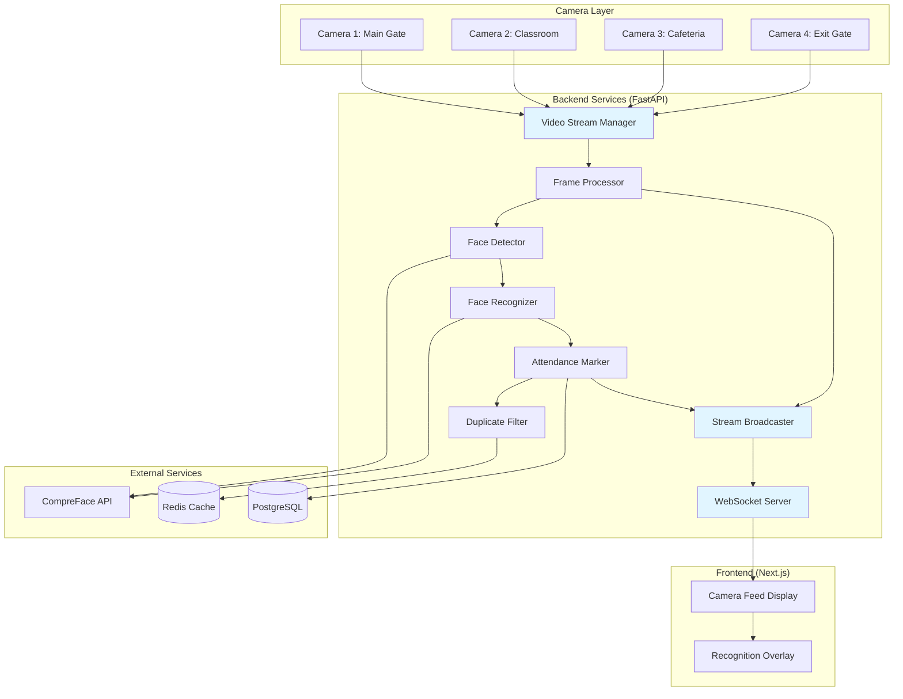
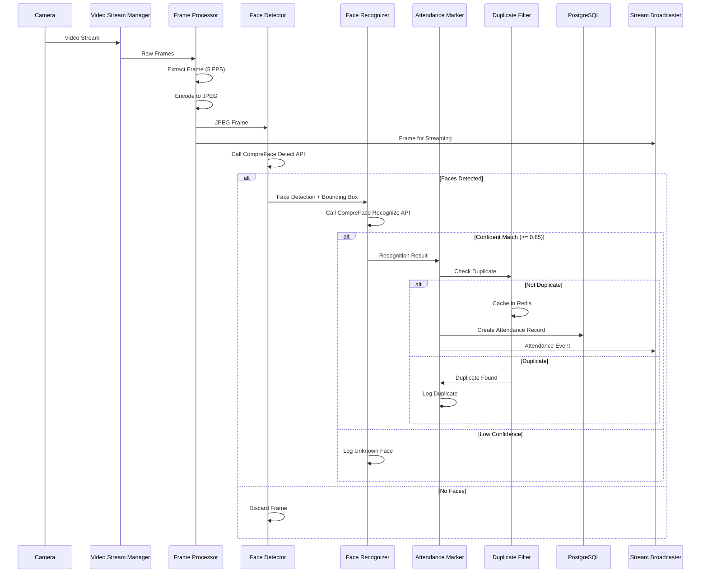
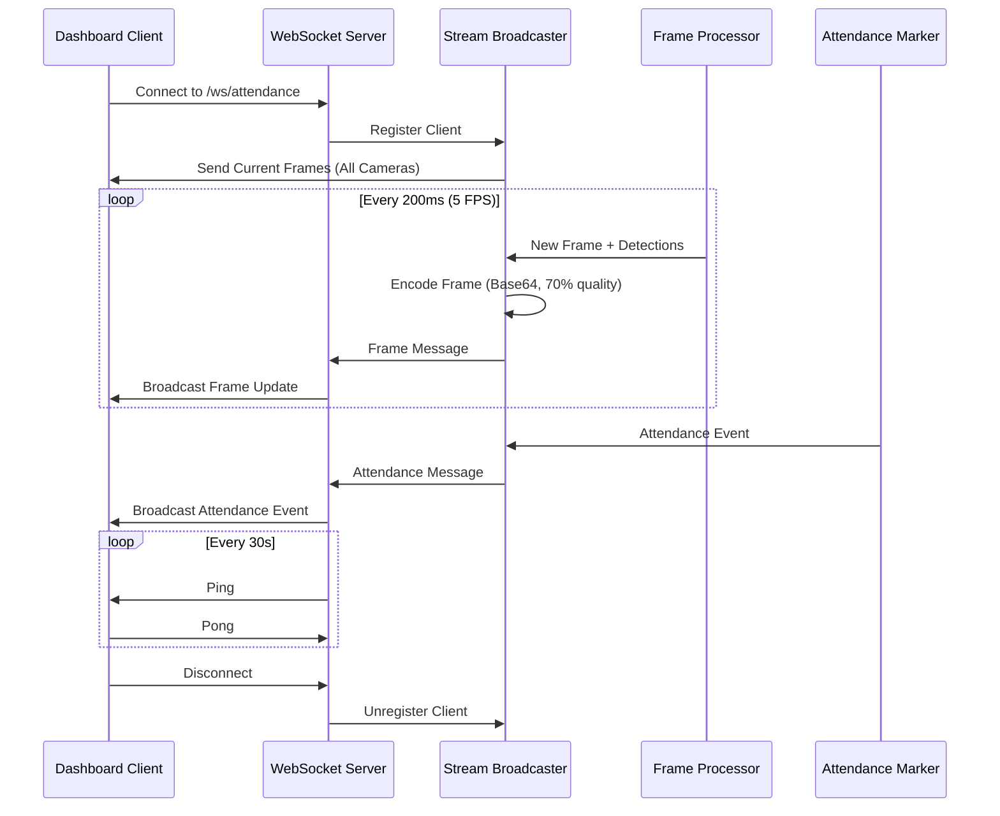
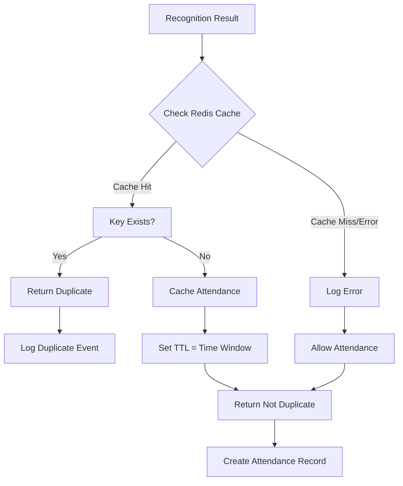

# Design Document: Real-Time Video Facial Recognition

## Overview

This design implements a real-time video streaming and facial recognition system for automated school attendance. The system captures video from 4 concurrent camera sources, processes frames to detect and recognize student faces using the CompreFace API, and automatically marks attendance while preventing duplicates. Live video feeds with recognition overlays are streamed to a Next.js dashboard via WebSocket connections.

The architecture follows a modular design with clear separation between video capture, frame processing, face detection/recognition, attendance marking, and real-time streaming components. The system is built on the existing FastAPI backend and integrates with the current PostgreSQL database and Redis cache.

### Key Design Goals

- Support 4 concurrent video streams with minimal latency
- Process 500+ unique student recognitions per hour
- Maintain frame processing latency below 500ms
- Prevent duplicate attendance entries within configurable time windows
- Stream live video with recognition overlays to dashboard clients
- Gracefully handle camera disconnections and API failures
- Optimize resource usage (CPU, memory, network bandwidth)

## Architecture

### High-Level Architecture



### Component Interaction Flow

1. **Video Capture Flow**: Camera sources → Video Stream Manager → Frame Processor
2. **Recognition Flow**: Frame Processor → Face Detector → Face Recognizer → Attendance Marker → Duplicate Filter
3. **Streaming Flow**: Frame Processor → Stream Broadcaster → WebSocket Server → Dashboard Clients
4. **Data Persistence**: Attendance Marker → PostgreSQL, Duplicate Filter → Redis

### Technology Stack

- **Backend Framework**: FastAPI with async/await support
- **Video Processing**: OpenCV (cv2) for frame capture and manipulation
- **Async I/O**: asyncio for concurrent stream processing
- **WebSocket**: FastAPI WebSocket support with connection management
- **Face Recognition**: CompreFace REST API
- **Caching**: Redis for duplicate detection
- **Database**: PostgreSQL with SQLAlchemy ORM
- **Image Encoding**: PIL/Pillow for JPEG compression
- **Frontend**: Next.js with WebSocket client

## Components and Interfaces

### 1. Video Stream Manager

**Responsibility**: Manages connections to 4 camera sources and maintains camera configuration.

**Interface**:
```python
class VideoStreamManager:
    async def start_camera(self, camera_id: str, stream_url: str, location: str) -> None
    async def stop_camera(self, camera_id: str) -> None
    async def get_camera_status(self, camera_id: str) -> CameraStatus
    async def reconnect_camera(self, camera_id: str) -> bool
    def get_all_cameras(self) -> List[CameraConfig]
```

**Key Attributes**:
- `cameras: Dict[str, CameraStream]` - Active camera connections
- `reconnect_interval: int = 30` - Seconds between reconnection attempts
- `supported_protocols: List[str] = ["rtsp", "http", "local"]`

**Implementation Details**:
- Uses OpenCV `cv2.VideoCapture` for stream connections
- Maintains separate asyncio task for each camera
- Implements exponential backoff for failed reconnections
- Logs camera status changes to database
- Emits camera status events to WebSocket clients

### 2. Frame Processor

**Responsibility**: Extracts frames from video streams at configurable rates and manages processing queues.

**Interface**:
```python
class FrameProcessor:
    async def process_stream(self, camera_id: str, video_capture: cv2.VideoCapture) -> None
    async def adjust_frame_rate(self, cpu_usage: float, memory_usage: float) -> None
    def encode_frame(self, frame: np.ndarray) -> bytes
    def get_queue_size(self, camera_id: str) -> int
```

**Key Attributes**:
- `frame_rate: int = 5` - Configurable FPS (1-10)
- `max_queue_size: int = 100` - Per-camera queue limit
- `processing_queues: Dict[str, asyncio.Queue]` - Frame queues per camera
- `jpeg_quality: int = 85` - Compression quality for CompreFace

**Implementation Details**:
- Extracts frames using `cv2.VideoCapture.read()`
- Converts frames to JPEG using PIL/Pillow
- Implements dynamic frame rate adjustment based on system resources
- Drops oldest frames when queue reaches capacity
- Uses asyncio queues for thread-safe frame passing

### 3. Face Detector

**Responsibility**: Detects faces in frames using CompreFace detection API.

**Interface**:
```python
class FaceDetector:
    async def detect_faces(self, frame_data: bytes, camera_id: str) -> List[FaceDetection]
    async def retry_detection(self, frame_data: bytes, max_retries: int = 2) -> Optional[List[FaceDetection]]
```

**Data Structures**:
```python
@dataclass
class FaceDetection:
    bounding_box: BoundingBox  # x, y, width, height
    camera_id: str
    timestamp: datetime
    frame_data: bytes
```

**Implementation Details**:
- Sends JPEG frames to CompreFace `/api/v1/detection/detect` endpoint
- Parses bounding box coordinates from response
- Implements retry logic with 1-second delays
- Filters out frames with no detected faces
- Handles multiple faces per frame independently

### 4. Face Recognizer

**Responsibility**: Matches detected faces against enrolled students using CompreFace recognition API.

**Interface**:
```python
class FaceRecognizer:
    async def recognize_face(self, face_detection: FaceDetection) -> Optional[RecognitionResult]
    def is_confident(self, similarity: float) -> bool
```

**Data Structures**:
```python
@dataclass
class RecognitionResult:
    student_id: UUID
    confidence: float
    camera_location: str
    timestamp: datetime
    bounding_box: BoundingBox
```

**Implementation Details**:
- Sends face crops to CompreFace `/api/v1/recognition/recognize` endpoint
- Applies confidence threshold (0.85 minimum)
- Logs unknown face events for unrecognized detections
- Includes camera location and timestamp metadata
- Handles CompreFace API errors gracefully

### 5. Attendance Marker

**Responsibility**: Creates attendance records for recognized students after duplicate checking.

**Interface**:
```python
class AttendanceMarker:
    async def mark_attendance(self, recognition: RecognitionResult) -> Optional[AttendanceRecord]
    async def publish_attendance_event(self, record: AttendanceRecord) -> None
```

**Implementation Details**:
- Checks for duplicates via Duplicate Filter before creating records
- Persists attendance records to PostgreSQL
- Publishes attendance events to Stream Broadcaster
- Includes student_id, camera_location, timestamp, confidence_score
- Logs duplicate attempts for monitoring

### 6. Duplicate Filter

**Responsibility**: Prevents duplicate attendance entries within configurable time windows using Redis.

**Interface**:
```python
class DuplicateFilter:
    async def is_duplicate(self, student_id: UUID, camera_location: str) -> bool
    async def cache_attendance(self, student_id: UUID, camera_location: str) -> None
```

**Key Attributes**:
- `time_window_minutes: int` - From DUPLICATE_WINDOW_MINUTES config
- `cache_key_format: str = "attendance:recent:{student_id}:{camera_location}"`

**Implementation Details**:
- Checks Redis for existing attendance within time window
- Uses Redis TTL equal to time window in seconds
- Falls back to allowing attendance if Redis connection fails
- Implements per-camera duplicate detection (same student can mark attendance at different cameras)

### 7. Stream Broadcaster

**Responsibility**: Transmits video frames and recognition data to connected dashboard clients.

**Interface**:
```python
class StreamBroadcaster:
    async def broadcast_frame(self, camera_id: str, frame_data: bytes, detections: List[FaceDetection]) -> None
    async def broadcast_attendance_event(self, event: AttendanceEvent) -> None
    def add_client(self, client_id: str, websocket: WebSocket) -> None
    def remove_client(self, client_id: str) -> None
```

**Data Structures**:
```python
@dataclass
class FrameMessage:
    camera_id: str
    frame_data: str  # Base64 encoded JPEG
    timestamp: datetime
    detections: List[Dict]  # Bounding boxes and recognition data

@dataclass
class AttendanceEvent:
    student_id: UUID
    student_name: str
    camera_location: str
    timestamp: datetime
    confidence_score: float
```

**Implementation Details**:
- Encodes frames as Base64 JPEG with 70% quality
- Limits broadcast rate to 5 FPS per client
- Pauses transmission when no clients connected
- Includes recognition overlays in frame metadata
- Manages client connection list

### 8. WebSocket Server

**Responsibility**: Manages WebSocket connections and bidirectional communication with dashboard clients.

**Interface**:
```python
@app.websocket("/ws/attendance")
async def websocket_endpoint(websocket: WebSocket) -> None

class WebSocketManager:
    async def connect(self, websocket: WebSocket) -> str
    async def disconnect(self, client_id: str) -> None
    async def send_message(self, client_id: str, message: dict) -> None
    async def broadcast(self, message: dict) -> None
    async def heartbeat(self) -> None
```

**Message Types**:
- `frame_update`: Video frame with detection overlays
- `attendance_event`: New attendance record created
- `camera_status`: Camera online/offline status
- `ping/pong`: Heartbeat messages

**Implementation Details**:
- Accepts connections on `/ws/attendance` endpoint
- Implements ping/pong heartbeat every 30 seconds
- Cleans up disconnected clients automatically
- Broadcasts attendance events to all connected clients
- Sends initial camera frames on connection

## Data Models

### Database Schema Updates

**New Table: cameras**
```sql
CREATE TABLE cameras (
    id UUID PRIMARY KEY DEFAULT gen_random_uuid(),
    camera_id VARCHAR(50) UNIQUE NOT NULL,
    location_name VARCHAR(100) NOT NULL,
    stream_url VARCHAR(500) NOT NULL,
    protocol VARCHAR(20) NOT NULL,  -- 'rtsp', 'http', 'local'
    status VARCHAR(20) DEFAULT 'offline',  -- 'online', 'offline', 'error'
    last_seen_at TIMESTAMP WITH TIME ZONE,
    error_message TEXT,
    is_active BOOLEAN DEFAULT true,
    created_at TIMESTAMP WITH TIME ZONE DEFAULT NOW(),
    updated_at TIMESTAMP WITH TIME ZONE
);

CREATE INDEX idx_cameras_status ON cameras(status);
CREATE INDEX idx_cameras_active ON cameras(is_active);
```

**Updated Table: attendance_records**
```sql
-- Add index for duplicate detection queries
CREATE INDEX idx_attendance_student_camera_time 
ON attendance_records(student_id, camera_location, timestamp DESC);
```

### SQLAlchemy Models

```python
class Camera(Base):
    __tablename__ = "cameras"
    
    id = Column(UUID(as_uuid=True), primary_key=True, default=uuid.uuid4)
    camera_id = Column(String(50), unique=True, nullable=False)
    location_name = Column(String(100), nullable=False)
    stream_url = Column(String(500), nullable=False)
    protocol = Column(String(20), nullable=False)
    status = Column(String(20), default='offline')
    last_seen_at = Column(DateTime(timezone=True))
    error_message = Column(Text)
    is_active = Column(Boolean, default=True)
    created_at = Column(DateTime(timezone=True), server_default=func.now())
    updated_at = Column(DateTime(timezone=True), onupdate=func.now())
```

### Redis Data Structures

**Duplicate Detection Cache**:
- Key: `attendance:recent:{student_id}:{camera_location}`
- Value: `{timestamp}`
- TTL: `DUPLICATE_WINDOW_MINUTES * 60` seconds

**Camera Status Cache**:
- Key: `camera:status:{camera_id}`
- Value: `{status, last_seen, error_message}`
- TTL: 60 seconds

## API Endpoint Specifications

### Camera Management Endpoints

**POST /api/v1/cameras**
```python
Request Body:
{
    "camera_id": "main_gate",
    "location_name": "Main Gate",
    "stream_url": "rtsp://192.168.1.100:554/stream",
    "protocol": "rtsp"
}

Response: 201 Created
{
    "id": "uuid",
    "camera_id": "main_gate",
    "location_name": "Main Gate",
    "stream_url": "rtsp://192.168.1.100:554/stream",
    "protocol": "rtsp",
    "status": "offline",
    "created_at": "2024-01-15T10:30:00Z"
}
```

**GET /api/v1/cameras**
```python
Response: 200 OK
{
    "cameras": [
        {
            "id": "uuid",
            "camera_id": "main_gate",
            "location_name": "Main Gate",
            "status": "online",
            "last_seen_at": "2024-01-15T10:35:00Z"
        }
    ]
}
```

**PUT /api/v1/cameras/{camera_id}**
```python
Request Body:
{
    "location_name": "Main Entrance",
    "stream_url": "rtsp://192.168.1.101:554/stream"
}

Response: 200 OK
{
    "id": "uuid",
    "camera_id": "main_gate",
    "location_name": "Main Entrance",
    "stream_url": "rtsp://192.168.1.101:554/stream",
    "status": "online",
    "updated_at": "2024-01-15T10:40:00Z"
}
```

**DELETE /api/v1/cameras/{camera_id}**
```python
Response: 204 No Content
```

**GET /api/v1/cameras/{camera_id}/status**
```python
Response: 200 OK
{
    "camera_id": "main_gate",
    "status": "online",
    "last_seen_at": "2024-01-15T10:35:00Z",
    "error_message": null
}
```

### WebSocket Endpoint

**WS /ws/attendance**

Connection established, then bidirectional messages:

**Client → Server**:
```json
{
    "type": "ping"
}
```

**Server → Client** (Frame Update):
```json
{
    "type": "frame_update",
    "camera_id": "main_gate",
    "frame_data": "base64_encoded_jpeg_string",
    "timestamp": "2024-01-15T10:35:00Z",
    "detections": [
        {
            "bounding_box": {"x": 100, "y": 150, "width": 80, "height": 100},
            "student_id": "uuid",
            "student_name": "John Doe",
            "confidence": 0.92
        }
    ]
}
```

**Server → Client** (Attendance Event):
```json
{
    "type": "attendance_event",
    "student_id": "uuid",
    "student_name": "John Doe",
    "camera_location": "main_gate",
    "timestamp": "2024-01-15T10:35:00Z",
    "confidence_score": 0.92
}
```

**Server → Client** (Camera Status):
```json
{
    "type": "camera_status",
    "camera_id": "main_gate",
    "status": "online",
    "timestamp": "2024-01-15T10:35:00Z"
}
```

## Data Flow Diagrams

### Frame Processing Flow



### WebSocket Streaming Flow



### Duplicate Detection Flow



## Performance Optimization Strategies

### 1. Concurrent Stream Processing

**Strategy**: Use asyncio for non-blocking I/O operations across all 4 camera streams.

**Implementation**:
```python
async def process_all_cameras():
    tasks = [
        asyncio.create_task(process_camera(camera_id))
        for camera_id in camera_manager.get_all_cameras()
    ]
    await asyncio.gather(*tasks)
```

**Benefits**:
- Eliminates blocking on I/O operations
- Maximizes CPU utilization
- Maintains independent processing per camera

### 2. API Request Throttling

**Strategy**: Limit concurrent CompreFace API requests to 8 maximum using semaphore.

**Implementation**:
```python
api_semaphore = asyncio.Semaphore(8)

async def call_compreface_api(endpoint, data):
    async with api_semaphore:
        return await make_api_request(endpoint, data)
```

**Benefits**:
- Prevents API rate limiting
- Reduces memory usage from pending requests
- Maintains predictable latency

### 3. Dynamic Frame Rate Adjustment

**Strategy**: Monitor system resources and reduce frame rate when thresholds exceeded.

**Implementation**:
```python
async def monitor_resources():
    while True:
        cpu_usage = psutil.cpu_percent()
        memory_usage = psutil.virtual_memory().percent
        
        if cpu_usage > 80:
            frame_processor.frame_rate *= 0.5
        elif memory_usage > 90:
            frame_processor.frame_rate *= 0.75
        
        await asyncio.sleep(10)
```

**Benefits**:
- Prevents system overload
- Maintains stability under high load
- Graceful degradation

### 4. Frame Queue Management

**Strategy**: Implement bounded queues with oldest-frame-drop policy.

**Implementation**:
```python
async def add_frame_to_queue(camera_id, frame):
    queue = processing_queues[camera_id]
    if queue.full():
        await queue.get()  # Drop oldest frame
    await queue.put(frame)
```

**Benefits**:
- Prevents memory overflow
- Maintains real-time processing
- Prioritizes recent frames

### 5. Efficient Image Encoding

**Strategy**: Use optimized JPEG compression with quality tuning per use case.

**Implementation**:
```python
# For CompreFace API (higher quality)
compreface_frame = encode_jpeg(frame, quality=85)

# For WebSocket streaming (lower quality)
stream_frame = encode_jpeg(frame, quality=70)
```

**Benefits**:
- Reduces network bandwidth
- Faster API requests
- Lower memory usage

### 6. Redis Caching for Duplicate Detection

**Strategy**: Use Redis with TTL for fast duplicate lookups instead of database queries.

**Implementation**:
```python
async def is_duplicate(student_id, camera_location):
    key = f"attendance:recent:{student_id}:{camera_location}"
    exists = await redis.exists(key)
    if not exists:
        await redis.setex(key, time_window_seconds, "1")
    return exists
```

**Benefits**:
- Sub-millisecond duplicate checks
- Reduces database load
- Automatic expiration via TTL

### 7. Conditional WebSocket Broadcasting

**Strategy**: Pause frame transmission when no clients connected.

**Implementation**:
```python
async def broadcast_frame(frame_data):
    if not websocket_manager.has_clients():
        return  # Skip encoding and transmission
    
    encoded_frame = encode_for_streaming(frame_data)
    await websocket_manager.broadcast(encoded_frame)
```

**Benefits**:
- Saves CPU on encoding
- Reduces memory usage
- Conserves network bandwidth

### 8. Database Connection Pooling

**Strategy**: Use SQLAlchemy connection pool with optimized settings.

**Implementation**:
```python
engine = create_engine(
    database_url,
    pool_size=10,
    max_overflow=20,
    pool_pre_ping=True
)
```

**Benefits**:
- Reuses database connections
- Reduces connection overhead
- Handles connection failures gracefully

## Integration with Existing System

### FastAPI Backend Integration

**New Service Module**: `app/services/video_streaming.py`
- Contains VideoStreamManager, FrameProcessor, FaceDetector, FaceRecognizer
- Integrates with existing CompreFaceService
- Uses existing database session management

**New Routes Module**: `app/routes/cameras.py`
- Implements camera management REST API
- Uses existing authentication middleware
- Follows existing route patterns

**WebSocket Integration**: `app/routes/websocket.py`
- New WebSocket endpoint for real-time streaming
- Integrates with existing CORS configuration
- Uses existing error handling patterns

**Updated Main Application**:
```python
# app/main.py additions
from app.routes import cameras, websocket
from app.services.video_streaming import VideoStreamingService

# Initialize video streaming service
video_service = VideoStreamingService()

@app.on_event("startup")
async def startup_event():
    await video_service.start()

@app.on_event("shutdown")
async def shutdown_event():
    await video_service.stop()

# Include new routers
app.include_router(cameras.router, prefix="/api/v1/cameras", tags=["cameras"])
app.include_router(websocket.router, tags=["websocket"])
```

### Next.js Frontend Integration

**New Component**: `app/components/CameraFeed.tsx`
```typescript
interface CameraFeedProps {
    cameraId: string;
    locationName: string;
}

export function CameraFeed({ cameraId, locationName }: CameraFeedProps) {
    const [frameData, setFrameData] = useState<string | null>(null);
    const [detections, setDetections] = useState<Detection[]>([]);
    
    useEffect(() => {
        const ws = new WebSocket('ws://localhost:8000/ws/attendance');
        
        ws.onmessage = (event) => {
            const message = JSON.parse(event.data);
            if (message.type === 'frame_update' && message.camera_id === cameraId) {
                setFrameData(message.frame_data);
                setDetections(message.detections);
            }
        };
        
        return () => ws.close();
    }, [cameraId]);
    
    return (
        <div className="relative">
            {frameData && }
            {detections.map(d => <RecognitionOverlay key={d.student_id} detection={d} />)}
        </div>
    );
}
```

**Updated Page**: `app/cameras/page.tsx`
- Replace static camera placeholders with CameraFeed components
- Add WebSocket connection management
- Display real-time recognition overlays

**New Hook**: `lib/useWebSocket.ts`
```typescript
export function useWebSocket(url: string) {
    const [ws, setWs] = useState<WebSocket | null>(null);
    const [messages, setMessages] = useState<any[]>([]);
    
    useEffect(() => {
        const websocket = new WebSocket(url);
        
        websocket.onmessage = (event) => {
            setMessages(prev => [...prev, JSON.parse(event.data)]);
        };
        
        setWs(websocket);
        return () => websocket.close();
    }, [url]);
    
    return { ws, messages };
}
```

### Database Migration

**Migration Script**: `migrations/add_cameras_table.sql`
```sql
-- Create cameras table
CREATE TABLE cameras (
    id UUID PRIMARY KEY DEFAULT gen_random_uuid(),
    camera_id VARCHAR(50) UNIQUE NOT NULL,
    location_name VARCHAR(100) NOT NULL,
    stream_url VARCHAR(500) NOT NULL,
    protocol VARCHAR(20) NOT NULL,
    status VARCHAR(20) DEFAULT 'offline',
    last_seen_at TIMESTAMP WITH TIME ZONE,
    error_message TEXT,
    is_active BOOLEAN DEFAULT true,
    created_at TIMESTAMP WITH TIME ZONE DEFAULT NOW(),
    updated_at TIMESTAMP WITH TIME ZONE
);

-- Create indexes
CREATE INDEX idx_cameras_status ON cameras(status);
CREATE INDEX idx_cameras_active ON cameras(is_active);
CREATE INDEX idx_attendance_student_camera_time 
ON attendance_records(student_id, camera_location, timestamp DESC);

-- Insert default cameras
INSERT INTO cameras (camera_id, location_name, stream_url, protocol) VALUES
('main_gate', 'Main Gate', 'rtsp://192.168.1.100:554/stream', 'rtsp'),
('classroom_building', 'Classroom Building', 'rtsp://192.168.1.101:554/stream', 'rtsp'),
('cafeteria', 'Cafeteria', 'rtsp://192.168.1.102:554/stream', 'rtsp'),
('exit_gate', 'Exit Gate', 'rtsp://192.168.1.103:554/stream', 'rtsp');
```

### Environment Configuration

**Updated `.env` file**:
```bash
# Existing configuration...

# Video Streaming Configuration
FRAME_RATE=5
MAX_CONCURRENT_API_REQUESTS=8
JPEG_QUALITY_COMPREFACE=85
JPEG_QUALITY_STREAMING=70
MAX_FRAME_QUEUE_SIZE=100
WEBSOCKET_HEARTBEAT_INTERVAL=30

# Resource Limits
MAX_MEMORY_GB=2
CPU_THRESHOLD_PERCENT=80
MEMORY_THRESHOLD_PERCENT=90
```

### Dependencies

**Updated `requirements.txt`**:
```
# Existing dependencies...

# Video Processing
opencv-python==4.8.1.78
opencv-python-headless==4.8.1.78

# Image Processing
Pillow==10.1.0

# System Monitoring
psutil==5.9.6

# WebSocket
websockets==12.0
```

**Updated `package.json`** (Frontend):
```json
{
  "dependencies": {
    "existing dependencies...": "...",
    "reconnecting-websocket": "^4.4.0"
  }
}
```

